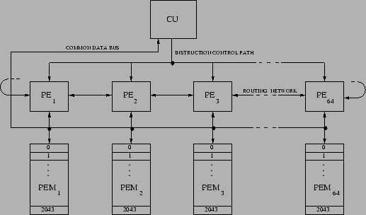
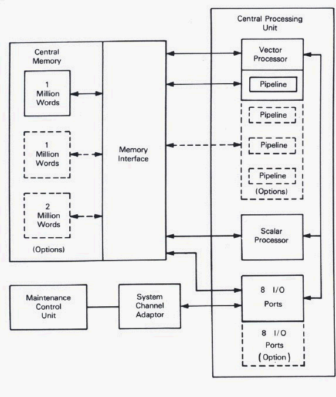

# Store supercomputer architecture documents here
Research alternatives for “supercomputer architecture” in the literature, e.g., using Google. Research two architectures and select diagrams that describe them; the architecture could be a specific supercomputer. Your notes should cover about 1/4-page.

Alternatives for supercomputers architecture can be achieved by increasing computing vertically or horizontally:
- Vertical: Building a bigger supercomputer.
- Horizontal: Using many smallers systems in parallel to create a supercomputing cluster, this is what most of the companies use, it allows to scale up bigger and faster than a monolithic supercomputer, plus it allows companies to use existing computing resources, thereby significantly reducing costs. 

_https://gcn.com/cloud-infrastructure/2015/09/supercomputing-without-the-supercomputer/285360/_

## Supercomputer architectures
- [The ILLIAC IV](http://www.hpjava.org/talks/beijing/hpf/introduction/node4.html)

- [The CYBER 205](https://homepages.inf.ed.ac.uk/rni/comp-arch/Vect/cyber-f.html)
